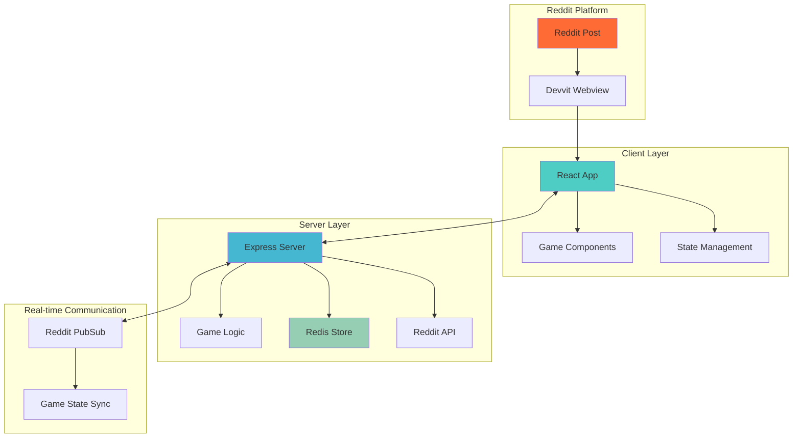
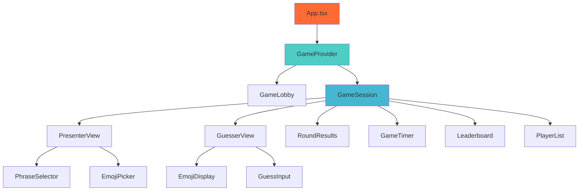

# Emojirades Game Design Document

## Overview

The Emojirades Game is a real-time multiplayer guessing game built on Reddit's Devvit platform. Players take turns as presenters who represent phrases using emojis, while others guess the phrase. The game leverages React for the frontend, Express for the backend, Redis for state persistence, and Reddit's real-time messaging for multiplayer synchronization.

## Architecture

### High-Level Architecture



### Technology Stack

- **Frontend**: React 19.1.0 with TypeScript, TailwindCSS
- **Backend**: Express 5.1.0 with TypeScript
- **State Management**: React Context + Custom Hooks
- **Data Persistence**: Redis (via Devvit)
- **Real-time Communication**: Reddit's PubSub system
- **Build System**: Vite for both client and server
- **Platform**: Devvit Web Framework

## Components and Interfaces

### Client Components Architecture



### Component Specifications

#### GameProvider (Context Provider)
```typescript
interface GameContextType {
  gameState: GameState;
  currentUser: Player;
  joinGame: () => Promise<void>;
  startGame: () => Promise<void>;
  submitEmojis: (emojis: string[]) => Promise<void>;
  submitGuess: (guess: string) => Promise<void>;
  endRound: () => Promise<void>;
}
```

#### GameLobby Component
- **Purpose**: Waiting room for players before game starts
- **Features**: Player list, ready status, start button (for moderators)
- **State**: Connected players, ready states, game configuration

#### PresenterView Component
- **Purpose**: Interface for the current presenter
- **Features**: Phrase selection, emoji picker, submission interface
- **State**: Selected phrase, emoji sequence, submission status

#### GuesserView Component
- **Purpose**: Interface for players making guesses
- **Features**: Emoji display, guess input, guess history
- **State**: Current emojis, submitted guesses, guess validation

#### EmojiPicker Component
- **Purpose**: Searchable emoji selection interface
- **Features**: Category filtering, search functionality, recent emojis
- **Data**: Emoji categories, search index, selection state

### Server API Endpoints

#### Game Management
```typescript
// Game lifecycle endpoints
POST /api/game/create     // Create new game session
POST /api/game/join       // Join existing game
POST /api/game/start      // Start game (moderator only)
POST /api/game/end        // End game session
GET  /api/game/state      // Get current game state

// Round management
POST /api/round/start     // Start new round
POST /api/round/end       // End current round
POST /api/emojis/submit   // Submit emoji sequence (presenter)
POST /api/guess/submit    // Submit guess (guesser)

// Data endpoints
GET  /api/phrases         // Get phrase categories and data
GET  /api/leaderboard     // Get current scores
GET  /api/players         // Get active players
```

#### Real-time Events
```typescript
// PubSub event types
type GameEvent = 
  | { type: 'PLAYER_JOINED'; player: Player }
  | { type: 'GAME_STARTED'; gameState: GameState }
  | { type: 'ROUND_STARTED'; round: Round }
  | { type: 'EMOJIS_SUBMITTED'; emojis: string[] }
  | { type: 'GUESS_SUBMITTED'; guess: Guess }
  | { type: 'ROUND_ENDED'; result: RoundResult }
  | { type: 'TIMER_UPDATE'; remaining: number };
```

## Data Models

### Core Game State
```typescript
interface GameState {
  id: string;
  subredditName: string;
  status: 'lobby' | 'active' | 'paused' | 'ended';
  currentRound: number;
  maxRounds: number;
  createdAt: number;
  updatedAt: number;
}

interface Round {
  id: string;
  gameId: string;
  roundNumber: number;
  presenterId: string;
  phrase: Phrase;
  emojiSequence: string[];
  guesses: Guess[];
  status: 'waiting' | 'active' | 'ended';
  startTime: number;
  endTime?: number;
  winnerId?: string;
}

interface Player {
  id: string;
  username: string;
  subredditName: string;
  score: number;
  isActive: boolean;
  joinedAt: number;
}

interface Phrase {
  id: string;
  text: string;
  category: string;
  difficulty: 'easy' | 'medium' | 'hard';
  hints?: string[];
}

interface Guess {
  id: string;
  playerId: string;
  username: string;
  text: string;
  similarity: number;
  isCorrect: boolean;
  timestamp: number;
}
```

### Redis Data Structure
```typescript
// Redis key patterns
const REDIS_KEYS = {
  GAME: (gameId: string) => `game:${gameId}`,
  ROUND: (gameId: string, roundId: string) => `game:${gameId}:round:${roundId}`,
  PLAYERS: (gameId: string) => `game:${gameId}:players`,
  LEADERBOARD: (subreddit: string) => `leaderboard:${subreddit}`,
  PHRASES: 'phrases:all',
  ACTIVE_GAMES: (subreddit: string) => `active_games:${subreddit}`
};

// Data storage patterns
interface RedisGameData {
  gameState: GameState;
  currentRound: Round | null;
  players: Record<string, Player>;
  scores: Record<string, number>;
  roundHistory: Round[];
}
```

## Error Handling

### Client-Side Error Handling
```typescript
interface ErrorBoundaryState {
  hasError: boolean;
  error?: Error;
  errorInfo?: string;
}

// Error types
type GameError = 
  | 'NETWORK_ERROR'
  | 'INVALID_GUESS'
  | 'RATE_LIMITED'
  | 'GAME_NOT_FOUND'
  | 'UNAUTHORIZED'
  | 'TIMEOUT';

// Error handling strategy
const handleGameError = (error: GameError, context: string) => {
  // Log error for debugging
  console.error(`Game Error [${context}]:`, error);
  
  // Show user-friendly message
  showToast(getErrorMessage(error));
  
  // Attempt recovery if possible
  if (error === 'NETWORK_ERROR') {
    attemptReconnection();
  }
};
```

### Server-Side Error Handling
```typescript
// Middleware for error handling
const errorHandler = (err: Error, req: Request, res: Response, next: NextFunction) => {
  console.error('Server Error:', err);
  
  if (err instanceof ValidationError) {
    return res.status(400).json({ error: 'Invalid input', details: err.message });
  }
  
  if (err instanceof RateLimitError) {
    return res.status(429).json({ error: 'Rate limit exceeded' });
  }
  
  return res.status(500).json({ error: 'Internal server error' });
};

// Input validation
const validateGuess = (guess: string): boolean => {
  return guess.length > 0 && guess.length <= 100 && /^[a-zA-Z0-9\s\-'.,!?]+$/.test(guess);
};
```

## Testing Strategy

### Unit Testing
- **Component Testing**: React Testing Library for component behavior
- **Hook Testing**: Custom hooks with mock data
- **Utility Testing**: Fuzzy matching algorithm, validation functions
- **API Testing**: Server endpoint testing with mock Redis

### Integration Testing
- **Client-Server Communication**: API endpoint integration
- **Real-time Features**: PubSub message handling
- **Redis Operations**: Data persistence and retrieval
- **Game Flow**: Complete round lifecycle testing

### End-to-End Testing
- **Multi-player Scenarios**: Simulated concurrent players
- **Game Session Lifecycle**: From lobby to completion
- **Error Recovery**: Network failures and reconnection
- **Mobile Compatibility**: Touch interactions and responsive design

### Testing Tools
```typescript
// Test utilities
const createMockGameState = (): GameState => ({
  id: 'test-game-1',
  subredditName: 'test_subreddit',
  status: 'lobby',
  currentRound: 0,
  maxRounds: 5,
  createdAt: Date.now(),
  updatedAt: Date.now()
});

const mockRedisOperations = {
  get: jest.fn(),
  set: jest.fn(),
  incrBy: jest.fn(),
  publish: jest.fn(),
  subscribe: jest.fn()
};
```

## Performance Considerations

### Client Optimization
- **Code Splitting**: Lazy load game components
- **Memoization**: React.memo for expensive components
- **Debouncing**: Guess input and emoji search
- **Virtual Scrolling**: Large emoji picker lists

### Server Optimization
- **Rate Limiting**: Prevent spam and abuse
- **Caching**: Phrase data and leaderboards
- **Connection Pooling**: Redis connection management
- **Request Validation**: Early input validation

### Real-time Performance
- **Message Batching**: Group related updates
- **Selective Updates**: Only send relevant data to each player
- **Heartbeat System**: Monitor connection health
- **Graceful Degradation**: Fallback for connection issues

## Security Considerations

### Input Validation
- **Server-side Validation**: All user inputs validated on server
- **XSS Prevention**: Sanitize all user-generated content
- **Rate Limiting**: Prevent abuse and spam
- **Content Filtering**: Inappropriate phrase/guess detection

### Authentication & Authorization
- **Reddit Authentication**: Leverage Devvit's built-in auth
- **Role-based Access**: Moderator vs. player permissions
- **Session Management**: Secure game session handling
- **Anti-cheating**: Prevent presenter from guessing own phrases

## Deployment Architecture

### Build Process
```bash
# Development
npm run dev  # Concurrent client, server, and devvit processes

# Production
npm run build      # Build both client and server
npm run deploy     # Upload to Reddit
npm run launch     # Publish for review
```

### Environment Configuration
```typescript
// Environment variables
interface Config {
  NODE_ENV: 'development' | 'production';
  REDIS_URL: string;
  MAX_PLAYERS_PER_GAME: number;
  ROUND_DURATION_MS: number;
  RATE_LIMIT_WINDOW_MS: number;
  RATE_LIMIT_MAX_REQUESTS: number;
}
```

### Monitoring & Logging
- **Error Tracking**: Comprehensive error logging
- **Performance Metrics**: Response times and throughput
- **Game Analytics**: Player engagement and completion rates
- **Health Checks**: System status monitoring

This design provides a robust foundation for implementing the multiplayer Emojirades game while leveraging the Devvit platform's capabilities and ensuring scalability, security, and maintainability.
