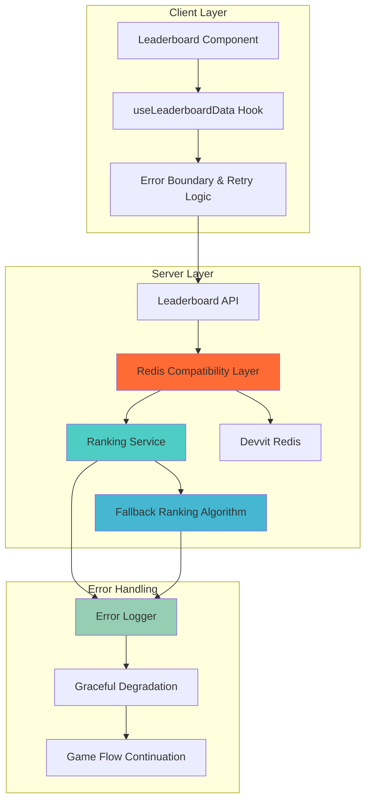

# Redis Compatibility Fix Design Document

## Overview

This design addresses the critical Redis compatibility issue in the Emojirades Game where `redis.zRevRank` is not available in Devvit's Redis implementation, causing leaderboard failures and blocking multiplayer game progression. The solution involves implementing alternative ranking algorithms, improving error handling, and ensuring game flow continuity even when leaderboard operations fail.

## Architecture

### Current Problem Analysis

The current implementation fails because:
1. `redis.zRevRank(key, member)` is not supported in Devvit Redis
2. The `getPlayerRank` function throws an exception when this method is called
3. The leaderboard API returns a 400 error, blocking the entire game flow
4. No fallback mechanism exists for ranking calculation failures

### Proposed Solution Architecture



## Components and Interfaces

### Redis Compatibility Layer

```typescript
interface RedisCompatibilityLayer {
  // Supported operations
  zRange(key: string, start: number, stop: number, options?: any): Promise<string[]>;
  zRangeByScore(key: string, min: string, max: string, options?: any): Promise<string[]>;
  zAdd(key: string, score: number, member: string): Promise<number>;
  zScore(key: string, member: string): Promise<string | null>;
  
  // Compatibility wrappers
  getPlayerRank(key: string, member: string): Promise<number>;
  isMethodSupported(method: string): boolean;
  
  // Error handling
  handleUnsupportedOperation(method: string, fallback: () => Promise<any>): Promise<any>;
}
```

### Alternative Ranking Algorithm

```typescript
interface RankingService {
  calculatePlayerRank(subredditName: string, username: string): Promise<number>;
  getLeaderboardWithRanks(subredditName: string, limit: number): Promise<LeaderboardEntry[]>;
  updatePlayerScore(subredditName: string, username: string, score: number): Promise<void>;
}

interface LeaderboardEntry {
  username: string;
  score: number;
  rank: number;
}
```

### Error Handling and Fallback System

```typescript
interface ErrorHandlingService {
  handleRedisError(error: Error, operation: string): Promise<any>;
  provideFallbackData(operation: string, params: any): Promise<any>;
  logCompatibilityIssue(method: string, error: Error): void;
  shouldRetry(error: Error, attemptCount: number): boolean;
}
```

## Data Models

### Redis Compatibility Configuration

```typescript
interface RedisCompatibilityConfig {
  supportedMethods: Set<string>;
  fallbackStrategies: Record<string, FallbackStrategy>;
  retryConfig: {
    maxAttempts: number;
    backoffMultiplier: number;
    initialDelay: number;
  };
  logging: {
    logUnsupportedMethods: boolean;
    logPerformanceMetrics: boolean;
  };
}

interface FallbackStrategy {
  method: 'alternative_algorithm' | 'cached_data' | 'default_value';
  implementation: (params: any) => Promise<any>;
}
```

### Enhanced Error Response Format

```typescript
interface EnhancedApiResponse<T> {
  success: boolean;
  data?: T;
  error?: string;
  fallbackUsed?: boolean;
  compatibilityIssue?: {
    unsupportedMethod: string;
    alternativeUsed: string;
  };
  timestamp: number;
}
```

## Error Handling

### Redis Method Compatibility Check

```typescript
class RedisCompatibilityManager {
  private supportedMethods = new Set([
    'get', 'set', 'hGet', 'hSet', 'hGetAll', 'hDel',
    'zAdd', 'zRange', 'zRangeByScore', 'zScore', 'zCard',
    'incrBy', 'expire', 'del', 'exists'
  ]);

  async executeWithFallback<T>(
    operation: () => Promise<T>,
    fallback: () => Promise<T>,
    operationName: string
  ): Promise<T> {
    try {
      return await operation();
    } catch (error) {
      if (this.isCompatibilityError(error)) {
        console.warn(`Redis compatibility issue with ${operationName}, using fallback`);
        return await fallback();
      }
      throw error;
    }
  }

  private isCompatibilityError(error: Error): boolean {
    return error.message.includes('is not a function') ||
           error.message.includes('not supported') ||
           error.message.includes('unknown command');
  }
}
```

### Alternative Player Ranking Algorithm

```typescript
class AlternativeRankingService {
  async getPlayerRank(subredditName: string, username: string): Promise<number> {
    try {
      // Get all players with scores using zRange (supported method)
      const leaderboardKey = `leaderboard:${subredditName}`;
      const allPlayers = await redis.zRange(leaderboardKey, 0, -1, { 
        REV: true, 
        BY: 'SCORE' 
      });
      
      // Find player's position in the sorted list
      for (let i = 0; i < allPlayers.length; i += 2) {
        if (allPlayers[i] === username) {
          return Math.floor(i / 2) + 1; // Convert index to rank (1-based)
        }
      }
      
      return 0; // Player not found in leaderboard
    } catch (error) {
      console.error('Error calculating player rank:', error);
      return 0; // Fallback rank
    }
  }

  async getLeaderboardWithRanks(
    subredditName: string, 
    limit: number
  ): Promise<LeaderboardEntry[]> {
    try {
      const leaderboardKey = `leaderboard:${subredditName}`;
      const topPlayers = await redis.zRange(leaderboardKey, 0, limit - 1, {
        REV: true,
        BY: 'SCORE'
      });

      const entries: LeaderboardEntry[] = [];
      for (let i = 0; i < topPlayers.length; i += 2) {
        const username = topPlayers[i];
        const score = parseInt(topPlayers[i + 1]);
        const rank = Math.floor(i / 2) + 1;

        entries.push({ username, score, rank });
      }

      return entries;
    } catch (error) {
      console.error('Error getting leaderboard with ranks:', error);
      return []; // Return empty array as fallback
    }
  }
}
```

### Enhanced Leaderboard API Implementation

```typescript
// Updated getPlayerRank function
export async function getPlayerRank(
  subredditName: string, 
  username: string
): Promise<number> {
  try {
    const subredditValidation = validateSubredditName(subredditName);
    if (!subredditValidation.isValid) {
      throw new GameException('INVALID_INPUT', subredditValidation.errors[0]);
    }

    const usernameValidation = validateUsername(username);
    if (!usernameValidation.isValid) {
      throw new GameException('INVALID_INPUT', usernameValidation.errors[0]);
    }

    // Use alternative ranking algorithm instead of zRevRank
    const rankingService = new AlternativeRankingService();
    return await rankingService.getPlayerRank(subredditName, username);
    
  } catch (error) {
    console.error('Error getting player rank:', error);
    
    // Don't throw exception for ranking errors - return fallback rank
    if (error instanceof GameException) {
      throw error; // Re-throw validation errors
    }
    
    // For Redis compatibility errors, return fallback rank
    console.warn(`Using fallback rank for ${username} due to Redis compatibility issue`);
    return 0;
  }
}

// Updated getLeaderboard function
export async function getLeaderboard(
  subredditName: string, 
  limit: number = 10
): Promise<LeaderboardResponse> {
  try {
    const subredditValidation = validateSubredditName(subredditName);
    if (!subredditValidation.isValid) {
      throw new GameException('INVALID_INPUT', subredditValidation.errors[0]);
    }

    const rankingService = new AlternativeRankingService();
    const entries = await rankingService.getLeaderboardWithRanks(subredditName, limit);
    
    // Convert to Player objects
    const players: Player[] = entries.map(entry => ({
      id: `leaderboard_${entry.username}`,
      username: entry.username,
      subredditName,
      score: entry.score,
      isActive: false,
      joinedAt: Date.now(),
    }));

    return {
      success: true,
      data: {
        players,
        totalPlayers: entries.length,
        subredditName,
      },
      timestamp: Date.now(),
    };
    
  } catch (error) {
    console.error('Error in getLeaderboard:', error);
    
    if (error instanceof GameException) {
      throw error;
    }
    
    // Return empty leaderboard as fallback
    return {
      success: true,
      data: {
        players: [],
        totalPlayers: 0,
        subredditName,
      },
      fallbackUsed: true,
      timestamp: Date.now(),
    };
  }
}
```

### Client-Side Error Handling Improvements

```typescript
// Enhanced useLeaderboardData hook
export const useLeaderboardData = (subredditName: string, limit: number = 10) => {
  const [retryCount, setRetryCount] = useState(0);
  const [fallbackMode, setFallbackMode] = useState(false);

  const fetchLeaderboard = useCallback(async () => {
    if (!subredditName) return;

    try {
      setLoading(true);
      setError(null);

      const response = await fetch(
        `/api/leaderboard/${encodeURIComponent(subredditName)}?limit=${limit}`
      );
      
      if (!response.ok) {
        throw new Error(`HTTP ${response.status}`);
      }

      const data = await response.json();
      
      if (!data.success) {
        throw new Error(data.error || 'Failed to fetch leaderboard');
      }

      setPlayers(data.data.players || []);
      setFallbackMode(data.fallbackUsed || false);
      setRetryCount(0); // Reset retry count on success
      
    } catch (err) {
      console.error('Error fetching leaderboard:', err);
      
      // Implement exponential backoff for retries
      if (retryCount < 3) {
        const delay = Math.pow(2, retryCount) * 1000; // 1s, 2s, 4s
        setTimeout(() => {
          setRetryCount(prev => prev + 1);
          fetchLeaderboard();
        }, delay);
      } else {
        setError(err instanceof Error ? err.message : 'Failed to load leaderboard');
        setFallbackMode(true);
      }
    } finally {
      setLoading(false);
    }
  }, [subredditName, limit, retryCount]);

  return {
    players,
    loading,
    error,
    fallbackMode,
    refresh: fetchLeaderboard,
  };
};
```

## Testing Strategy

### Redis Compatibility Testing

```typescript
describe('Redis Compatibility Layer', () => {
  test('should handle unsupported zRevRank method', async () => {
    const mockRedis = {
      zRevRank: undefined, // Simulate Devvit environment
      zRange: jest.fn().mockResolvedValue(['user1', '100', 'user2', '90'])
    };

    const rankingService = new AlternativeRankingService();
    const rank = await rankingService.getPlayerRank('test_subreddit', 'user1');
    
    expect(rank).toBe(1);
    expect(mockRedis.zRange).toHaveBeenCalled();
  });

  test('should provide fallback data when Redis operations fail', async () => {
    const mockRedis = {
      zRange: jest.fn().mockRejectedValue(new Error('Redis error'))
    };

    const rankingService = new AlternativeRankingService();
    const rank = await rankingService.getPlayerRank('test_subreddit', 'user1');
    
    expect(rank).toBe(0); // Fallback rank
  });
});
```

### Integration Testing

```typescript
describe('Leaderboard API Integration', () => {
  test('should return leaderboard data even with Redis compatibility issues', async () => {
    const response = await request(app)
      .get('/api/leaderboard/test_subreddit?limit=5')
      .expect(200);

    expect(response.body.success).toBe(true);
    expect(Array.isArray(response.body.data.players)).toBe(true);
  });

  test('should handle player rank requests gracefully', async () => {
    const response = await request(app)
      .get('/api/leaderboard/test_subreddit?username=testuser')
      .expect(200);

    expect(response.body.success).toBe(true);
    expect(typeof response.body.data.currentUserRank).toBe('number');
  });
});
```

## Performance Considerations

### Optimized Ranking Algorithm

- **Caching Strategy**: Cache leaderboard data for 30 seconds to reduce Redis calls
- **Batch Operations**: Retrieve all ranking data in single Redis call
- **Lazy Loading**: Only calculate detailed ranks when specifically requested
- **Memory Efficiency**: Process ranking data in streams for large leaderboards

### Error Recovery Optimization

- **Circuit Breaker**: Temporarily disable leaderboard features if Redis consistently fails
- **Graceful Degradation**: Show cached or simplified leaderboard data during outages
- **Background Retry**: Retry failed operations in background without blocking UI

## Security Considerations

### Input Validation Enhancement

```typescript
// Enhanced validation with Redis compatibility in mind
export const validateLeaderboardRequest = (subredditName: string, username?: string) => {
  const errors: string[] = [];
  
  // Validate subreddit name
  const subredditValidation = validateSubredditName(subredditName);
  if (!subredditValidation.isValid) {
    errors.push(...subredditValidation.errors);
  }
  
  // Validate username if provided
  if (username) {
    const usernameValidation = validateUsername(username);
    if (!usernameValidation.isValid) {
      errors.push(...usernameValidation.errors);
    }
  }
  
  return {
    isValid: errors.length === 0,
    errors
  };
};
```

### Rate Limiting for Fallback Operations

```typescript
// Implement rate limiting for expensive fallback operations
const rateLimiter = new Map<string, { count: number; resetTime: number }>();

const checkRateLimit = (key: string, maxRequests: number, windowMs: number): boolean => {
  const now = Date.now();
  const record = rateLimiter.get(key);
  
  if (!record || now > record.resetTime) {
    rateLimiter.set(key, { count: 1, resetTime: now + windowMs });
    return true;
  }
  
  if (record.count >= maxRequests) {
    return false;
  }
  
  record.count++;
  return true;
};
```

This design provides a comprehensive solution to the Redis compatibility issue while ensuring the multiplayer game flow continues to work smoothly even when leaderboard operations encounter problems. The implementation focuses on graceful degradation, alternative algorithms, and robust error handling to maintain game stability in the Devvit environment.
