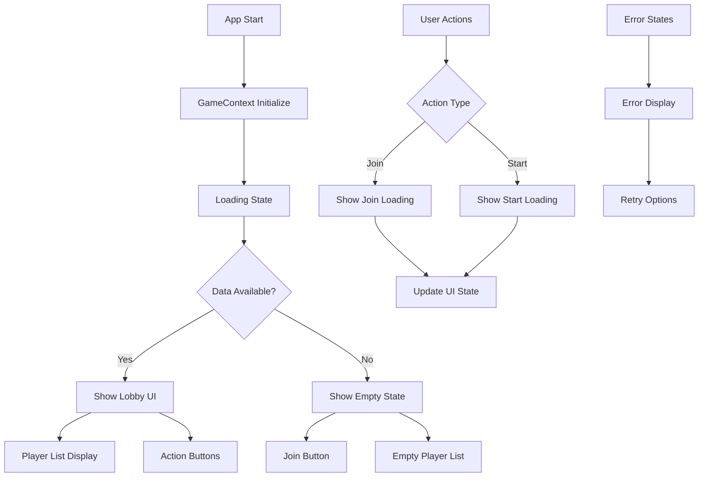

# Design Document

## Overview

This design addresses the UI display issues in the Emojirades game where the player list and join/start buttons are not visible on the initial screen. The root cause analysis reveals several issues: improper loading state management, missing fallback UI states, and potential race conditions between data fetching and UI rendering. The solution focuses on ensuring consistent UI state management, proper loading indicators, and robust fallback displays.

## Architecture

### Current Issues Analysis

1. **Loading State Management**: The GameLobby component may be stuck in loading states or not properly handling the transition from loading to loaded states
2. **Data Flow Issues**: The GameContext initialization might not be properly triggering UI updates when data becomes available
3. **Conditional Rendering Logic**: The component's conditional rendering may be hiding essential UI elements when certain conditions aren't met
4. **Empty State Handling**: Missing or inadequate empty state displays when no players are present
5. **Race Conditions**: Potential timing issues between component mounting, data fetching, and UI rendering

### Solution Architecture



## Components and Interfaces

### 1. Enhanced Loading State Management

**Purpose**: Ensure proper loading state transitions and prevent UI from getting stuck

**Key Changes**:
- Add explicit loading state checks for different operations
- Implement timeout mechanisms for loading states
- Provide fallback UI when loading takes too long
- Clear loading states appropriately after operations complete

**Interface**:
```typescript
interface LoadingStateManager {
  isInitializing: boolean;
  isJoining: boolean;
  isStarting: boolean;
  hasTimedOut: boolean;
  showFallbackUI: boolean;
}
```

### 2. Robust Empty State Display

**Purpose**: Always show appropriate UI elements even when no data is available

**Key Changes**:
- Display empty player list with invitation messaging
- Always show join button when user is not in game
- Provide clear calls-to-action for empty states
- Show game status information even with no players

**Interface**:
```typescript
interface EmptyStateProps {
  showJoinButton: boolean;
  playerCount: number;
  gameStatus: 'lobby' | 'active' | 'ended' | null;
  isLoading: boolean;
}
```

### 3. Conditional Rendering Logic Fix

**Purpose**: Ensure UI elements are displayed based on correct conditions

**Key Changes**:
- Simplify conditional rendering logic
- Always render essential UI structure
- Use loading overlays instead of conditional mounting
- Provide default values for all required props

**Logic Flow**:
```typescript
// Always render the lobby structure
const shouldShowJoinButton = !isUserInGame && gameState?.status === 'lobby';
const shouldShowStartButton = isCurrentUserModerator && canStartGame;
const shouldShowPlayerList = true; // Always show, with empty state if needed
```

### 4. Data Synchronization Improvements

**Purpose**: Ensure UI updates when data becomes available

**Key Changes**:
- Add explicit data validation before rendering
- Implement data refresh mechanisms
- Handle partial data states gracefully
- Provide manual refresh options for users

**Data Flow**:
```typescript
interface DataSyncState {
  hasValidGameState: boolean;
  hasValidPlayerData: boolean;
  hasValidUserData: boolean;
  lastUpdateTimestamp: number;
  needsRefresh: boolean;
}
```

## Data Models

### Enhanced UI State Model
```typescript
interface UIDisplayState {
  // Core display flags
  showLobby: boolean;
  showJoinButton: boolean;
  showStartButton: boolean;
  showPlayerList: boolean;
  
  // Loading states
  isInitialLoading: boolean;
  isJoining: boolean;
  isStarting: boolean;
  isRefreshing: boolean;
  
  // Error states
  hasError: boolean;
  errorMessage: string | null;
  canRetry: boolean;
  
  // Data availability
  hasGameData: boolean;
  hasPlayerData: boolean;
  hasUserData: boolean;
  
  // Fallback states
  showEmptyState: boolean;
  showLoadingFallback: boolean;
  showErrorFallback: boolean;
}
```

### Player List Display Model
```typescript
interface PlayerListDisplayData {
  players: Player[];
  currentUser: Player | null;
  moderator: Player | null;
  isEmpty: boolean;
  isLoading: boolean;
  emptyStateMessage: string;
  showAddPlayerPrompt: boolean;
}
```

## Error Handling

### 1. Loading Timeout Handling
- Implement 10-second timeout for initial loading
- Show fallback UI if loading exceeds timeout
- Provide manual refresh option
- Log timeout events for debugging

### 2. Data Validation
- Validate all incoming data before using in UI
- Provide default values for missing data
- Handle malformed or incomplete responses
- Show appropriate error messages for data issues

### 3. Network Error Recovery
- Detect network connectivity issues
- Provide offline state indicators
- Implement automatic retry with exponential backoff
- Allow manual retry for failed operations

### 4. Graceful Degradation
- Show partial UI when some data is unavailable
- Maintain core functionality even with errors
- Provide clear messaging about what's not working
- Allow users to continue with available features

## Testing Strategy

### 1. Loading State Tests
- Test initial loading behavior
- Verify loading timeout handling
- Test loading state transitions
- Validate loading indicator display

### 2. Empty State Tests
- Test empty player list display
- Verify join button visibility
- Test empty state messaging
- Validate call-to-action elements

### 3. Data Flow Tests
- Test data synchronization
- Verify UI updates on data changes
- Test partial data scenarios
- Validate error state handling

### 4. User Interaction Tests
- Test join button functionality
- Verify start button behavior
- Test loading feedback during actions
- Validate error handling for failed actions

## Implementation Phases

### Phase 1: Fix Loading State Management
1. Add explicit loading state checks in GameLobby component
2. Implement loading timeout mechanisms
3. Fix loading state transitions
4. Add fallback UI for stuck loading states

### Phase 2: Improve Empty State Display
1. Always render player list structure
2. Add empty state messaging and styling
3. Ensure join button is always visible when appropriate
4. Add clear calls-to-action for empty states

### Phase 3: Fix Conditional Rendering Logic
1. Simplify conditional rendering in GameLobby
2. Always render essential UI structure
3. Use loading overlays instead of conditional mounting
4. Provide default values for all props

### Phase 4: Enhance Data Synchronization
1. Add data validation before rendering
2. Implement manual refresh functionality
3. Handle partial data states gracefully
4. Add data freshness indicators

### Phase 5: Testing and Validation
1. Test all loading scenarios
2. Validate empty state displays
3. Test user interaction flows
4. Verify error handling behavior

## Performance Considerations

### 1. Rendering Optimization
- Minimize conditional rendering complexity
- Use React.memo for expensive components
- Optimize re-render patterns
- Cache computed values where appropriate

### 2. Loading Performance
- Show UI skeleton during loading
- Prioritize critical UI elements
- Use progressive loading for non-essential data
- Implement loading state caching

### 3. Network Efficiency
- Minimize redundant API calls
- Implement request deduplication
- Use efficient polling strategies
- Cache responses where appropriate

## Security Considerations

### 1. Data Validation
- Validate all server responses
- Sanitize user inputs
- Handle malformed data gracefully
- Prevent XSS through proper escaping

### 2. Error Information
- Avoid exposing sensitive error details
- Provide user-friendly error messages
- Log detailed errors server-side only
- Implement proper error boundaries

## Monitoring and Debugging

### 1. Loading Performance Metrics
- Track loading times
- Monitor timeout occurrences
- Measure UI responsiveness
- Log loading state transitions

### 2. Error Tracking
- Monitor UI rendering errors
- Track failed user actions
- Log data synchronization issues
- Monitor network connectivity problems

### 3. User Experience Metrics
- Track user interaction success rates
- Monitor abandonment during loading
- Measure time to first interaction
- Track error recovery success rates

This design provides a comprehensive solution to fix the UI display issues by addressing the root causes of missing player lists and action buttons, ensuring a consistent and reliable user experience from the moment users open the application.
